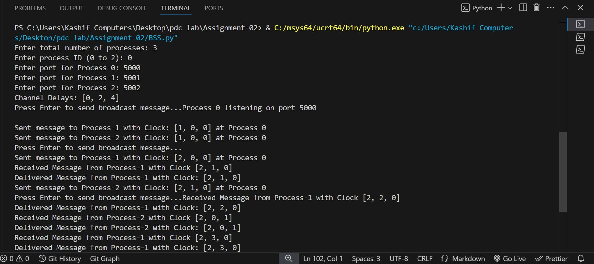
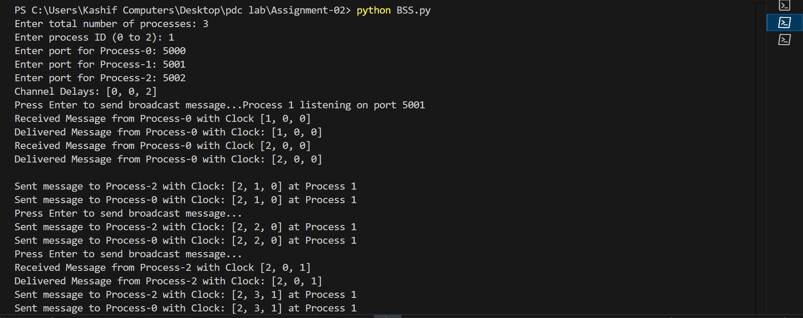
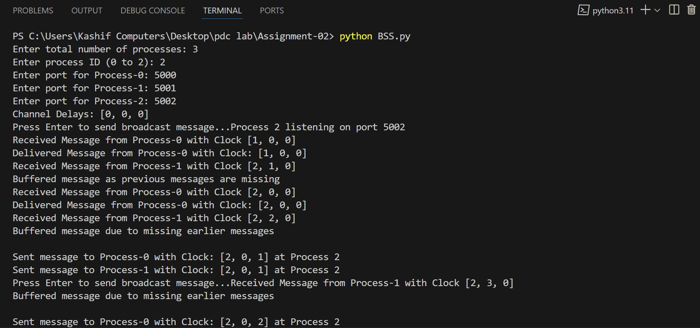
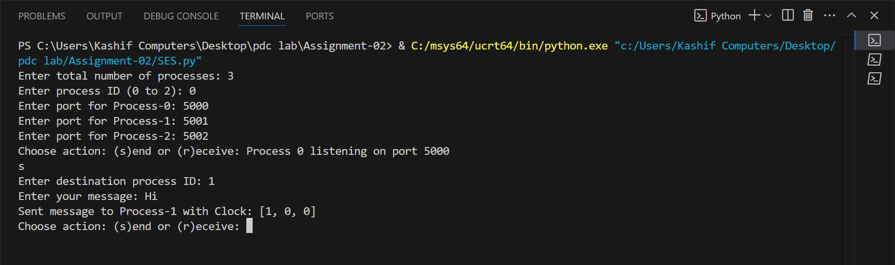
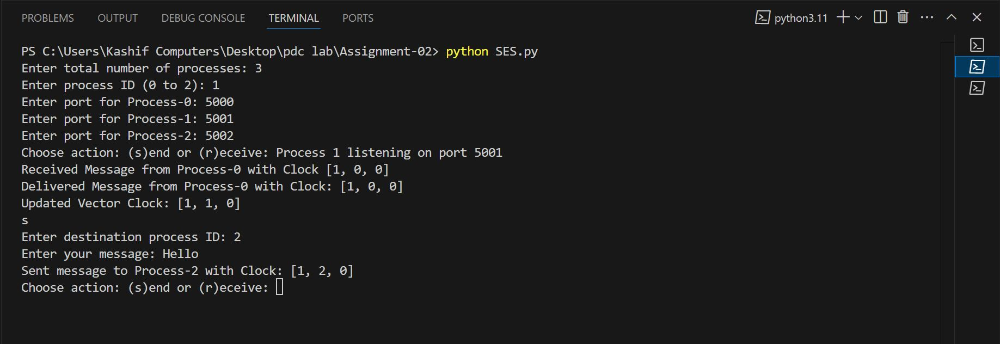
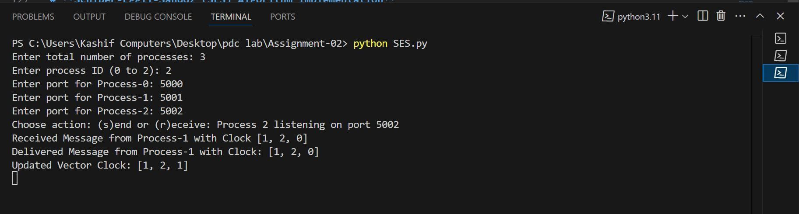

# Distributed Systems Causal Ordering Simulations

This repository contains four Python simulation implementations that demonstrate how to achieve causal ordering in distributed systems using different approaches. Each implementation is in a separate file:

- **BSS.py**: Implements BSS-based causal ordering using vector clocks.
- **SES.py**: Implements the Schwarz & Mattern (SES) approach using causal histories.
- **Matrix_clock.py**: Implements causal ordering using matrix clocks.
- **distributed_chat.py**: Simulates a real-world distributed chat application that uses matrix clocks to ensure that chat messages are delivered in a causally consistent manner.

---

## Contents

### 1. BSS.py
This simulation uses the **Birman-Schiper-Stephenson (BSS)** approach with vector clocks to track and enforce causal message ordering. Each process maintains a vector clock and attaches it to messages. A message is delivered only if its attached vector clock meets the causal delivery conditions at the receiver.

### 2. SES.py
This simulation implements the **Schwarz & Mattern (SES)** approach, which tracks dependencies using causal histories. Each process maintains a set of event identifiers as its causal history. When a message is sent, the current causal history is attached, and the receiver delivers the message only when all events in the sender’s history are known.

### 3. Matrix_clock.py
This simulation uses **Matrix Clocks** to provide a detailed tracking of causal dependencies. Each process maintains an n×n matrix clock that records every process's knowledge about each other's logical time. The message delivery condition is based on comparing the sender's row in the attached matrix clock with the receiver's local matrix clock.

### 4. distributed_chat.py
This is a practical simulation of a distributed chat application where each participant is a process using matrix clocks. It ensures that chat messages are delivered in the correct causal order. The application is interactive and supports local events, message sending, and state printing commands.

---

## Setup Instructions

### Requirements
- Python 3.x
- A terminal or command prompt

### Installation

1. **Clone the Repository:**

   ```bash
   git clone https://github.com/yourusername/causal-ordering-simulations.git
   cd causal-ordering-simulations
   ```

2. **Verify Python Installation:**

   ```bash
   python3 --version
   ```

### Running the Simulations

Each simulation is implemented in a separate Python file. Run them using the following commands:

- **BSS-based Causal Ordering Simulation:**
  ```bash
  python3 BSS.py
  ```

- **SES-based Causal Ordering Simulation:**
  ```bash
  python3 SES.py
  ```

- **Matrix Clock-based Causal Ordering Simulation:**
  ```bash
  python3 Matrix_clock.py
  ```

- **Distributed Chat Application (Matrix Clock-based):**
  ```bash
  python3 distributed_chat.py
  ```

---

## Sample Inputs and Outputs

### BSS Simulation (BSS.py)

### Option 1: Running in a Single Terminal
1. Open a terminal.
2. Run the Python script:
   ```sh
   python BSS.py
   ```
3. Enter the number of processes and process-specific details when prompted.
4. The program will manage process execution internally using threads.
5. Press **Enter** to send broadcast messages between processes.

### Option 2: Running in Multiple Terminals
To run the processes independently in different terminals:

1. **Open multiple terminal windows** (one for each process).
2. In each terminal, run the script with a different process ID.
   ```sh
   python BSS.py
   ```
3. When prompted, enter the same total number of processes and specify a unique process ID.
4. Assign different ports to each process to prevent conflicts.
5. Once all processes are running, press **Enter** in any terminal to trigger message broadcasts.

## Example Output
```
Enter total number of processes: 3
Enter process ID (0 to 2): 1
Enter port for Process-0: 5000
Enter port for Process-1: 5001
Enter port for Process-2: 5002
Channel Delays: [0, 0, 2]
Process 1 listening on port 5001
Press Enter to send broadcast message...
Sent message to Process-0 with Clock: [1, 1, 1] at process 1
Sent message to Process-2 with Clock: [1, 1, 1] at process 1
Received Message from Process-0 with Clock: [1, 0, 0]
Delivered Message from Process-0 with Clock: [1, 0, 0]
```
## Output in Multiple Terminals
At terminal 1,

At terminal 2,

At terminal 3,



### SES Simulation (SES.py)

# **Schiper-Eggli-Sandoz (SES) Algorithm Implementation**  

1. Open multiple terminal windows—one for each process.  
2. Run the script for each process using:  
   ```bash
   python SES.py
   ```
3. Enter the total number of processes and specify the process ID (unique for each process).  
4. Provide port numbers for all processes.  
5. Each process can then choose to **send** or **receive** messages. The vector clock is updated accordingly.  

This implementation ensures reliable **causal ordering** by buffering out-of-order messages and delivering them only when all dependencies are met.

## Output in Multiple Terminals
At terminal 1,

At terminal 2,

At terminal 3,


### Matrix Clock Simulation (Matrix_clock.py)

**Input Example:**
```
Enter number of processes: 3
Enter command: local 0
Enter command: send 0 2 Greetings from P0!
Enter command: print
Enter command: quit
```

**Sample Output:**
```
============================================================
Welcome to the Matrix Clock-based Causal Ordering Simulation!
============================================================
Enter number of processes: 3

Commands:
  local <pid>                      - Process <pid> performs a local event.
  send <sender> <recipient> <msg>  - Process <sender> sends <msg> to Process <recipient>.
  print                            - Print current matrix clocks and delivered messages for all processes.
  quit                             - Exit simulation.
============================================================

Enter command: local 0
------------------------------------------------------------
[Process P0] -- Local Event --
   Updated Matrix Clock:
           Row P0: [P0=1, P1=0, P2=0]
           Row P1: [P0=0, P1=0, P2=0]
           Row P2: [P0=0, P1=0, P2=0]
------------------------------------------------------------

Enter command: send 0 2 Greetings from P0!
------------------------------------------------------------
[Process P0] -- Local Event --
   Updated Matrix Clock:
           Row P0: [P0=2, P1=0, P2=0]
           Row P1: [P0=0, P1=0, P2=0]
           Row P2: [P0=0, P1=0, P2=0]
[Process P0] -- Sending Message --
   Message: 'Greetings from P0!'
   To: Process P2
   Attached Matrix Clock:
           Row P0: [P0=2, P1=0, P2=0]
           Row P1: [P0=0, P1=0, P2=0]
           Row P2: [P0=0, P1=0, P2=0]
[Process P2] -- Message Received --
   Message from P0: 'Greetings from P0!', Matrix Clock:
           Row P0: [P0=2, P1=0, P2=0]
           Row P1: [P0=0, P1=0, P2=0]
           Row P2: [P0=0, P1=0, P2=0]
------------------------------------------------------------

Enter command: print
------------------------------------------------------------
Process P0:
   Matrix Clock:
           Row P0: [P0=2, P1=0, P2=0]
           Row P1: [P0=0, P1=0, P2=0]
           Row P2: [P0=0, P1=0, P2=0]
   Delivered Messages: None
   Pending Message Queue: None
----------------------------------------
Process P1:
   Matrix Clock:
           Row P0: [P0=0, P1=0, P2=0]
           Row P1: [P0=0, P1=0, P2=0]
           Row P2: [P0=0, P1=0, P2=0]
   Delivered Messages: None
   Pending Message Queue: None
----------------------------------------
Process P2:
   Matrix Clock:
           Row P0: [P0=0, P1=0, P2=0]
           Row P1: [P0=0, P1=0, P2=0]
           Row P2: [P0=0, P1=0, P2=0]
   Delivered Messages:
      Message from P0: 'Greetings from P0!', Matrix Clock:
           Row P0: [P0=2, P1=0, P2=0]
           Row P1: [P0=0, P1=0, P2=0]
           Row P2: [P0=0, P1=0, P2=0]
   Pending Message Queue: None
----------------------------------------
------------------------------------------------------------
Enter command: quit
Exiting simulation. Goodbye!
```

### Distributed Chat Application (distributed_chat.py)

**Input Example:**
```
Enter number of chat participants: 3
Enter command: send 0 1 Hi, I'm P0!
Enter command: send 1 2 Hello from P1!
Enter command: local 2
Enter command: print
Enter command: quit
```

**Sample Output:**
```
============================================================
Welcome to the Distributed Chat Simulation (Matrix Clock-based Causal Ordering)!
============================================================
Enter number of chat participants: 3

Commands:
  local <pid>                      - Participant <pid> performs a local event.
  send <sender> <recipient> <msg>  - Participant <sender> sends a chat message <msg> to Participant <recipient>.
  print                            - Print current matrix clocks and delivered chat messages for all participants.
  quit                             - Exit simulation.
============================================================

Enter command: send 0 1 Hi, I'm P0!
------------------------------------------------------------
[ChatParticipant P0] -- Local Event Occurred --
   Updated Matrix Clock:
           Row P0: [P0=1, P1=0, P2=0]
           Row P1: [P0=0, P1=0, P2=0]
           Row P2: [P0=0, P1=0, P2=0]
[ChatParticipant P0] -- Sending Chat Message --
   Message: 'Hi, I'm P0!'
   To: ChatParticipant P1
   Attached Matrix Clock:
           Row P0: [P0=1, P1=0, P2=0]
           Row P1: [P0=0, P1=0, P2=0]
           Row P2: [P0=0, P1=0, P2=0]
[ChatParticipant P1] -- Chat Message Received --
   ChatMessage from P0: 'Hi, I'm P0!', Matrix Clock:
           Row P0: [P0=1, P1=0, P2=0]
           Row P1: [P0=0, P1=0, P2=0]
           Row P2: [P0=0, P1=0, P2=0]
------------------------------------------------------------
Enter command: send 1 2 Hello from P1!
------------------------------------------------------------
[ChatParticipant P1] -- Local Event Occurred --
   Updated Matrix Clock:
           Row P0: [P0=0, P1=0, P2=0]
           Row P1: [P0=0, P1=1, P2=0]
           Row P2: [P0=0, P1=0, P2=0]
[ChatParticipant P1] -- Sending Chat Message --
   Message: 'Hello from P1!'
   To: ChatParticipant P2
   Attached Matrix Clock:
           Row P0: [P0=0, P1=0, P2=0]
           Row P1: [P0=0, P1=1, P2=0]
           Row P2: [P0=0, P1=0, P2=0]
[ChatParticipant P2] -- Chat Message Received --
   ChatMessage from P1: 'Hello from P1!', Matrix Clock:
           Row P0: [P0=0, P1=0, P2=0]
           Row P1: [P0=0, P1=1, P2=0]
           Row P2: [P0=0, P1=0, P2=0]
------------------------------------------------------------
Enter command: local 2
------------------------------------------------------------
[ChatParticipant P2] -- Local Event Occurred --
   Updated Matrix Clock:
           Row P0: [P0=0, P1=0, P2=0]
           Row P1: [P0=0, P1=0, P2=0]
           Row P2: [P0=0, P1=0, P2=1]
------------------------------------------------------------
Enter command: print
------------------------------------------------------------
Participant P0:
   Matrix Clock:
           Row P0: [P0=1, P1=0, P2=0]
           Row P1: [P0=0, P1=0, P2=0]
           Row P2: [P0=0, P1=0, P2=0]
   Delivered Chat Messages:
      ChatMessage from P0: 'Hi, I'm P0!', Matrix Clock:
           Row P0: [P0=1, P1=0, P2=0]
           Row P1: [P0=0, P1=0, P2=0]
           Row P2: [P0=0, P1=0, P2=0]
   Pending Message Queue: None
----------------------------------------
Participant P1:
   Matrix Clock:
           Row P0: [P0=0, P1=0, P2=0]
           Row P1: [P0=0, P1=1, P2=0]
           Row P2: [P0=0, P1=0, P2=0]
   Delivered Chat Messages:
      ChatMessage from P0: 'Hi, I'm P0!', Matrix Clock:
           Row P0: [P0=1, P1=0, P2=0]
           Row P1: [P0=0, P1=0, P2=0]
           Row P2: [P0=0, P1=0, P2=0]
      ChatMessage from P1: 'Hello from P1!', Matrix Clock:
           Row P0: [P0=0, P1=0, P2=0]
           Row P1: [P0=0, P1=1, P2=0]
           Row P2: [P0=0, P1=0, P2=0]
   Pending Message Queue: None
----------------------------------------
Participant P2:
   Matrix Clock:
           Row P0: [P0=0, P1=0, P2=0]
           Row P1: [P0=0, P1=0, P2=0]
           Row P2: [P0=0, P1=0, P2=1]
   Delivered Chat Messages:
      ChatMessage from P1: 'Hello from P1!', Matrix Clock:
           Row P0: [P0=0, P1=0, P2=0]
           Row P1: [P0=0, P1=1, P2=0]
           Row P2: [P0=0, P1=0, P2=0]
   Pending Message Queue: None
----------------------------------------
------------------------------------------------------------
Enter command: quit
Exiting simulation. Goodbye!
```

## Contributing

Contributions, bug reports, and suggestions are welcome. Feel free to open an issue or submit a pull request.
